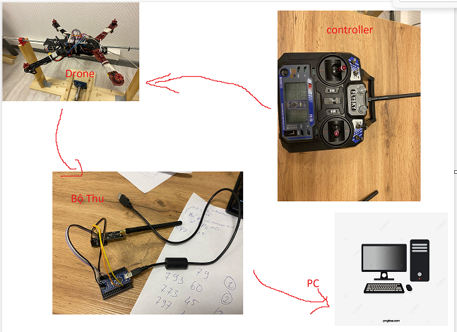

Mô hình



# Chương trình chính cho Drone :

- Thêm thư viện radio vào project: Tìm kiếm trong LIBRARY MANAGER của arduino IDE từ khóa "nrf24 TMRh20" cài thư viện đầu tiên của bảng tìm kiếm
- Include thư viện vào chương trình:

```sh
    #include <SPI.h>
    #include "printf.h"
    #include "RF24.h"
```

*Ghi chú :Chương trình ADAPTIVE dùng chân 9,10,11,12 cho PWM(motors) cần chuyển
pin 11 -> 5 và 12 -> 6 để dùng Radio

```sh
    motor_1.attach(6);                   
    motor_2.attach(5);
    motor_3.attach(10);
    motor_4.attach(9); 
```

- Khởi tạo các biến lưu dữ liệu và khai báo chân sử dụng:

```sh
// instantiate an object for the nRF24L01 transceiver
RF24 radio(7, 8);  // using pin 7 for the CE pin, and pin 8 for the CSN pin
// Let these addresses be used for the pair
uint8_t address[][6] = { "1Node", "2Node" };
bool radioNumber = 1;  // 0 uses address[0] to transmit, 1 uses address[1] to transmit
bool role = false;  // true = TX role, false = RX role

float payload_RX[5] ;//receiver from controller
float payload_TX[5] ;//send to pc
```

- Copy function Init_NRF24(), và gọi hàm vào phần setup() của chương trình

```sh
void Init_NRF24(void){
  // initialize the transceiver on the SPI bus
  if (!radio.begin()) {
    Serial.println(F("radio hardware is not responding!!"));
    while (1) {}  // hold in infinite loop
  }
  Serial.println("radio started");

  radio.setPALevel(RF24_PA_LOW);  // RF24_PA_MAX is default.
  radio.setPayloadSize(sizeof(payload_RX));  // float datatype occupies 4 bytes
  radio.openWritingPipe(address[radioNumber]);  // always uses pipe 0
  radio.openReadingPipe(1, address[!radioNumber]);  // using pipe 1
  radio.startListening();  // put radio in RX mode
}
```

    * Nếu lúc chạy chương trình mà serial trả về "radio hardware is not responding!!" cần kiểm tra lại phần cứng.

Thêm câu lệnh `Read_Data_NRF()` vào vòng loop để cập nhật giá trị mới cho RX data

```sh
  void Read_Data_NRF (void){
    if (role == 0){
        if (radio.available(&pipe)) {              // is there a payload? get the pipe number that recieved it
        uint8_t bytes = radio.getPayloadSize();  // get the size of the payload
          radio.read(&payload_RX, bytes);             // fetch payload from FIFO
          
          radio.stopListening();
          role = true;//switch to transmiter
        }
    }
  }
```

Để điều khiển Drone bằng controller sau khi đọc xong giá gán cho giá trị yêu cầu:

```sh
    THROLLTE0= payload_RX[0]; 
    thetaDesired[PITCH]=payload_RX[1]*M_PI/180;
    thetaDesired[ROLL]=payload_RX[2]*M_PI/180;
    thetaDesired[YAW]=payload_RX[3]*M_PI/180;
```

- Copy function vào chương trình để gởi dữ liệu về PC: (Và gán các giá trị payload_TX[] cần truyền ex: PWM,thetaDesired[PITCH], ... ) : Vì giá trị truyền đi có dạng data là float và 2 chữ số sau dấu phẩy nên nếu nên chỉnh số trước khi gởi.

    Hàm truyền về data về PC:

```sh
void Send_NRF_value (void){//
      // This device is a TX node
    radio.stopListening();
    delay(1);
      payload_TX[0] = 1.01;          // increment float payload
      payload_TX[1] = 2.02;
      payload_TX[2] = 3.03;
      payload_TX[3] = 4.04;
      payload_TX[4] = 5.05;
    unsigned long start_timer = micros();                // start the timer
    bool report = radio.write(&payload_TX, sizeof(payload_TX));  // transmit & save the report
    unsigned long end_timer = micros();                  // end the timer

    if (report) {
      Serial.print(F("Transmission successful! "));  // payload was delivered
      Serial.print(F("Time to transmit = "));
      Serial.print(end_timer - start_timer);  // print the timer result
      Serial.print(F(" us. Sent: "));
      Serial.println(payload_TX[0]);  // print payload sent
    } else {
      Serial.println(F("Transmission failed or timed out"));  // payload was not delivered
    }
}
```

Để gởi dữ liệu về pc thêm vào sau function PRINTRES()

```sh
Send_NRF_value()
```

# Sự thay đổi thời gian khi dùng rada
    - Thêm 1 ms để đợi NRF24 chuyển đổi chế từ truyền sang nhận(TX->RX) và ngược lại 
    - Thời gian để truyền thành công data -> PC là 1,3 ms
    - Thời gian để nhận data từ controller thành công là 0.7 ms 
    => cần thêm thêm 4 ms cho rada có thể thêm ngắt hoặc tăng thời gian PID cần xem xét lại

# Chương trình trên controller

```sh
    #include <SPI.h>
    #include "printf.h"
    #include "RF24.h"

    void Send_NRF_value (void);
    void Init_NRF24(void);
    RF24 radio(7,8);  // using pin 7 for the CE pin, and pin 8 for the CSN pin
    uint8_t address[][6] = { "1Node", "2Node" };
    bool radioNumber = 0;  // 0 uses address[0] to transmit, 1 uses address[1] to transmit
    bool role = true;  // true = TX role, false = RX role
    float payload[5];

    const int analog_pin1 = A1;   //Naming analog input pin//toi-800    - lui 0
    const int analog_pin2 = A0;   //Naming analog input pin//trais =0 ;  phai=800
    const int analog_pin3 = A3;   //Naming analog input pin// goc yall
    const int analog_pin4 = A2;   //Naming analog input pin//do cao

    int PIN_button_power_on=5;

    float inputVal1  = 0;          //Variable to store analog input values
    float inputVal2  = 0;          //Variable to store analog input values
    float inputVal3  = 0;          //Variable to store analog input values
    float inputVal4  = 0;          //Variable to store analog input values
    float inputVal5  = 0;          //Variable to power ON/OFF 1: ON ; 0:OFF Drone continue transmission

    void setup() {
    Serial.begin(115200);
    pinMode(PIN_button_power_on, INPUT);
    //Init_NRF24();
    }  // setup

    void loop() {
    inputVal1 = analogRead (analog_pin1);Serial.print(inputVal1);Serial.print(",");
    inputVal2 = analogRead (analog_pin2);Serial.print(inputVal2);Serial.print(",");
    inputVal3 = analogRead (analog_pin3);Serial.print(inputVal3);Serial.print(",");
    inputVal4 = analogRead (analog_pin4);Serial.println(inputVal4);

    if (digitalRead(PIN_button_power_on) == HIGH ){
        inputVal5 = 1; 
    }else inputVal5 = 0;
    Send_NRF_value();
    delay(1000);
    }  // loop

    void Init_NRF24(void){
        if (!radio.begin()) {
        Serial.println(F("radio hardware is not responding!!"));
        while (1) {}  // hold in infinite loop
    }
    radio.setPALevel(RF24_PA_LOW);  // RF24_PA_MAX is default.
    radio.setPayloadSize(20);  // float datatype occupies 4 bytes
    radio.openWritingPipe(address[radioNumber]);  // always uses pipe 0
    radio.openReadingPipe(1, address[!radioNumber]);  // using pipe 1
    radio.stopListening();  // put radio in TX mod
    }

    void Send_NRF_value (void){//
        // This device is a TX node
        payload[0] = map( inputVal1,74,825,1000,2000);          // increment float payload
        payload[1] = map( inputVal2,55,798,-90,90);
        payload[2] = map( inputVal3,40,778,-90,90);
        payload[3] = map( inputVal4,41,802,-90,90);
        payload[4] = inputVal5;
        unsigned long start_timer = micros();                // start the timer
        bool report = radio.write(&payload, sizeof(payload));  // transmit & save the report
        unsigned long end_timer = micros();                  // end the timer

        if (report) {
        Serial.print(F("Transmission successful! "));  // payload was delivered
        Serial.print(F("Time to transmit = "));
        Serial.print(end_timer - start_timer);  // print the timer result
        Serial.print(F(" us. Sent: "));
        Serial.println(payload[0]);  // print payload sent
        } else {
        Serial.println(F("Transmission failed or timed out"));  // payload was not delivered
        }
    }

```

#Chương trình bộ nhận để truyền sang pc

```sh

#include <SPI.h>
#include "printf.h"
#include "RF24.h"

void Init_NRF24(void);
void Read_NRF_value (void);
// instantiate an object for the nRF24L01 transceiver
RF24 radio(7, 8);  // using pin 7 for the CE pin, and pin 8 for the CSN pin
// Let these addresses be used for the pair
uint8_t address[][6] = { "1Node", "2Node" };
bool radioNumber = 0;  // 0 uses address[0] to transmit, 1 uses address[1] to transmit
bool role = false;  // true = TX role, false = RX role
float payload[5] ;


void setup() {
  Serial.begin(115200);
  delay(1);

  Init_NRF24();

}  // setup

void loop() {
  Read_NRF_value();
}  // loop

void Init_NRF24(void){
  // initialize the transceiver on the SPI bus
  if (!radio.begin()) {
    Serial.println(F("radio hardware is not responding!!"));
    while (1) {}  // hold in infinite loop
  }
  Serial.println("radio started");

  radio.setPALevel(RF24_PA_LOW);  // RF24_PA_MAX is default.
  radio.setPayloadSize(sizeof(payload));  // float datatype occupies 4 bytes
  radio.openWritingPipe(address[radioNumber]);  // always uses pipe 0
  radio.openReadingPipe(1, address[!radioNumber]);  // using pipe 1
  radio.startListening();  // put radio in RX mode
}

void Read_NRF_value (void){//
    uint8_t pipe;
    if (radio.available(&pipe)) {              // is there a payload? get the pipe number that recieved it
      uint8_t bytes = radio.getPayloadSize();  // get the size of the payload
      radio.read(&payload, bytes);             // fetch payload from FIFO
      Serial.print(payload[0]);Serial.print(",");  // print the payload's value
      Serial.print(payload[1]);Serial.print(",");  // print the payload's value
      Serial.print(payload[2]);Serial.print(",");  // print the payload's value
      Serial.print(payload[3]);Serial.print(",");  // print the payload's value
      Serial.println(payload[4]);  // print the payload's value
    }
}
```